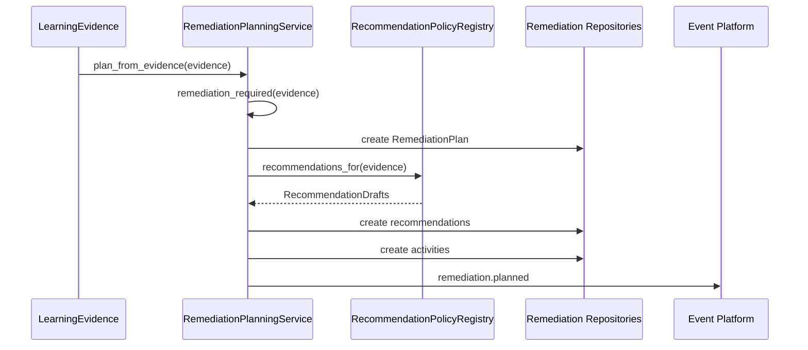

# Remediation Platform

## Status

Implemented for PI-5H.

## Purpose

The Remediation Platform transforms Learning Evidence into structured remediation plans.

Remediation is not assessment-specific. Assessment, Ariel teach-back, oral examinations, programming exercises, projects, clinical observations, simulations, and manual educator review can all become future evidence producers.

## Scope

PI-5H implements:

* `RemediationPlan`
* `RemediationRecommendation`
* `RemediationActivity`
* `RemediationAttempt`
* `RemediationOutcome`
* repository contracts and Django persistence adapters
* rule-based recommendation policies
* planning, recommendation, execution, and history services
* event integration
* REST API
* Django Admin integration

## Lifecycle

Remediation plans follow an explicit lifecycle:

```text
pending
  -> active
  -> completed
  -> closed

pending/active
  -> escalated
  -> closed

pending/active
  -> cancelled
  -> closed
```

Domain methods validate lifecycle transitions.

## Evidence Consumption

The platform consumes canonical `LearningEvidence`.

Evidence patterns are mapped by policy objects:

* misconception evidence recommends source review and educator review
* partial understanding recommends focused practice and additional questions
* low-confidence evidence recommends source material review

The policy registry is extensible so future AI policy engines or domain-specific recommendation policies can be plugged in without rewriting planning.

## Planning Flow



## Services

`RemediationPlanningService` consumes evidence, determines whether remediation is needed, builds plans, and assigns recommendations.

`RecommendationService` maps evidence patterns to recommendation drafts through a policy registry.

`RemediationExecutionService` coordinates lifecycle state, activity attempts, and outcomes. It does not perform instructional activities.

`RemediationHistoryService` provides learner plan history and plan timelines.

## Events

The platform publishes:

* `remediation.planned`
* `remediation.started`
* `remediation.completed`
* `remediation.escalated`
* `remediation.cancelled`
* `remediation.closed`

The platform includes an `EvidenceIntegratedConsumer` adapter that can consume existing assessment evidence integration events and invoke planning through the existing Event Platform.

## API

The REST API exposes:

* create remediation plan
* retrieve plan
* list learner remediation plans
* start remediation
* complete remediation
* cancel remediation
* retrieve remediation history

The API uses authenticated access and routes mutations through application services.

## Admin

Django Admin supports:

* active plans
* pending plans
* escalated plans
* completed plans
* recommendations
* activities
* attempts
* outcomes

Admin search supports learner, resource, concept, status, and related text fields where applicable.

## Boundaries

PI-5H does not implement:

* sequential unlocking
* learner progression
* AI remediation generation
* instructional activity execution
* assessment-specific remediation assumptions
* frontend UI

## Validation Commands

Human Docker validation should run:

```bash
docker compose exec backend python manage.py check
docker compose exec backend python manage.py makemigrations --check
docker compose exec backend python manage.py migrate
docker compose exec backend pytest apps/remediation
docker compose exec backend pytest apps/assessments
```
