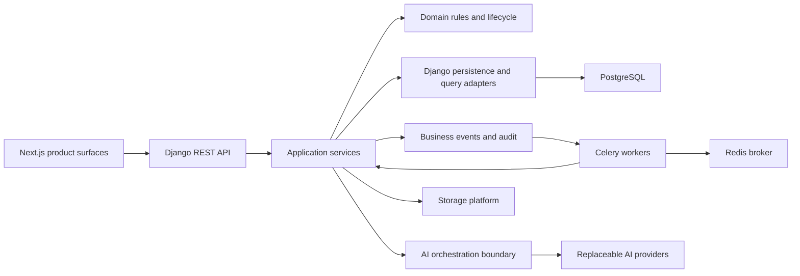
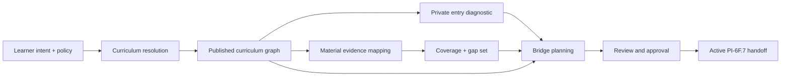

# Abbot Study Platform Implementation Report

## Executive summary

Abbot Study is being built as an AI-native education operating system rather than a collection of isolated study features. Its central architectural idea is that educational authority must remain deterministic, inspectable, and governed even when artificial intelligence assists with language generation, content interpretation, assessment, or personalization.

The platform now contains four substantial product layers:

1. A reusable institutional platform: identity, tenancy, settings, audit, events, notifications, files, background work, and API foundations.
2. A canonical academic and learning platform: subjects, curricula, ordered content, teaching sessions, grounding, assessment, evidence, mastery decisions, and remediation.
3. A governed content-supply chain: document processing, academic proposals, human review, immutable approval projections, controlled population, retrieval synchronization, and teaching-readiness evaluation.
4. A governed self-study supply chain: learner intent, policy, curriculum selection, immutable curriculum graphs, private entry diagnostics, evidence-to-curriculum coverage, and prerequisite bridge planning.

The result is not an autonomous teaching system that silently invents structure. It is a layered authority system in which source evidence becomes a proposal, proposals require governance, official Academic content remains the teaching authority, retrieval is synchronized from that authority, and readiness is granted only by a separate evidence-based gate.

Recent PI-6D through PI-6F capabilities are present in the repository but several remain explicitly marked as awaiting manual Docker validation, architecture review, or their capability commit. This report therefore distinguishes implementation from validated program completion.

## Product thesis

Abbot Study is designed to guide learners through ordered, evidence-aware education using trusted curricula and approved academic content. The intended experience combines:

- The Abbot teaching agent;
- Ariel and future learning companions;
- grounded conversational teaching;
- adaptive assessment and remediation;
- governed content ingestion;
- institutionally controlled academic truth;
- private diagnostic placement;
- deterministic curriculum and prerequisite planning;
- future learner intelligence and digital-twin capabilities.

The product constitution can be summarized in five rules:

- Order is sacred: learning order cannot depend on database IDs, queue timing, timestamps, or unconstrained model output.
- Draft before official: extracted, parsed, projected, and generated material is not Academic truth until it crosses an explicit governance boundary.
- AI is orchestrated: providers do not own curriculum, pedagogy, persistence, or policy.
- Evidence precedes authority: important decisions retain lineage, fingerprints, citations, findings, and actors.
- Trust beats magic: automation is rejected when it makes the system less explainable or controllable.

## Platform architecture



### Architectural style

The backend is a modular Django and Django REST Framework application organized into bounded contexts. Domain concepts and lifecycle rules live in domain/model packages, orchestration lives in application services, and framework endpoints remain thin. `models.py` acts as Django's discovery bridge when models are split into focused domain modules.

The practical dependency rule is:

```text
API view → application service → domain rule / persistence boundary
                         └──────→ business event → asynchronous worker
```

Cross-context behavior prefers business events or explicit query gateways over arbitrary ORM imports. Where a capability must reconcile several systems, an infrastructure adapter assembles a safe immutable snapshot and the policy layer evaluates that snapshot without performing database queries.

### Runtime topology

The development runtime uses Docker Compose:

- Django/DRF backend;
- Next.js frontend;
- PostgreSQL as durable system of record;
- Redis as Celery broker;
- Celery worker for identifier-only background workflows;
- mounted source volumes for local development.

Docker is the canonical validation environment. Local host behavior is not treated as authoritative when it differs from the containerized stack.

## What has been built

### PI-0 and PI-1: constitution and engineering foundation

The foundation established the architectural constitution, domain-driven modularity, Docker topology, backend and frontend skeletons, architecture decision records, dependency rules, testing conventions, and framework integration guidance.

This work matters because later AI and workflow capabilities inherit stable rules rather than inventing architectural patterns independently.

### PI-2: reusable platform services

The repository contains reusable bounded contexts for:

- users, identity, authentication, and institutional membership;
- settings and hierarchical configuration;
- audit entries and audit events;
- business-event publication and subscribers;
- notifications;
- file and storage management;
- shared core utilities and API behavior.

These services provide tenancy, traceability, and operational control to the academic, learning, assessment, and content systems.

### PI-3: canonical Academic Platform

The Academic Platform is the source of official educational structure and content. It includes:

- subjects;
- curricula and curriculum units;
- learning resources;
- ordered content sections;
- ordered content concepts;
- resource ingestion contracts;
- manual authoring;
- quality and review state;
- institutional APIs and administration.

The decisive design choice is that parsers and AI systems do not own `ContentSection` or `ContentConcept`. They can propose content, but official records are created or changed through Academic application services and governance.

### PI-4: Pedagogical Engine

The learning engine separates what is taught from how it is taught. Implemented layers include:

- pedagogical sessions and messages;
- instructional context assembly;
- grounding packages and source references;
- deterministic instructional-strategy selection;
- conversation orchestration and context management;
- The Abbot teaching-agent coordinator;
- the reusable learning-companion platform, with Ariel as the first companion;
- orchestration hardening and regression review.

Teaching strategy is selected before AI language generation. Conversation state does not become curriculum authority, and AI providers remain replaceable behind the orchestration boundary.

### PI-5: Evidence of Learning Platform

The assessment platform treats assessments as one form of learning evidence rather than the entire definition of learning. It includes:

- assessment foundations and blueprints;
- question authoring and governed item banks;
- assessment delivery sessions;
- deterministic evaluation and grading boundaries;
- evidence integration;
- mastery decisions and profiles;
- sequential learning controls;
- remediation planning and lifecycle;
- assessment review and platform hardening.

The architecture distinguishes raw responses, evaluated results, integrated evidence, and governed mastery decisions. This prevents a single transport response or UI event from silently becoming durable mastery authority.

### PI-6A and PI-6C: content intelligence and processing

Content ingestion begins with durable source files and processing jobs. The processing architecture supports:

- PDF and DOCX inspection;
- native-text extraction;
- selective OCR fallback;
- ordered extracted blocks;
- hierarchy reconstruction;
- deterministic semantic segmentation;
- processing attempts, diagnostics, retry, and cancellation;
- confidence and source evidence;
- asynchronous, resumable pipeline stages.

Raw files are evidence, not truth. Extraction blocks and semantic segments preserve source locators and provenance, while interpretation remains a proposal for later review.

### Governed academic proposal and review flow

The academic-import and academic-review contexts turn processing output into governed proposals. The implemented flow separates:

1. processing evidence;
2. proposed academic structure;
3. human review decisions and edits;
4. finding resolution;
5. approval readiness;
6. immutable approved projection;
7. controlled Academic population.

Reviewers work against ordered proposal items and immutable evidence. Approval is a separate operation from review completion. The approved projection freezes what was approved so that population does not reinterpret the proposal later.

### Controlled Academic population

Population is replay-safe and maps immutable approved projection items into official Academic records. It preserves proposal, projection, source, section, concept, version, and fingerprint lineage.

Population does not automatically synchronize retrieval and does not grant teaching readiness.

### Retrieval foundation and PI-6D.4 synchronization

The Retrieval Platform supports versioned chunk collections, provider-independent embeddings, hybrid indexing, citations, grounding packages, synchronization runs, candidate generations, and atomic active-generation promotion.

PI-6D.4 tightened the authority boundary:

- official Academic content supplies retrievable text;
- processing evidence supplies citations and provenance;
- missing official content is a stable application validation failure;
- projection or segment text cannot replace absent official Academic text;
- a candidate generation is built before promotion;
- promotion occurs only after count, index, lineage, and citation reconciliation;
- a failed candidate never displaces the previous active generation.

`SYNCHRONIZED` explicitly does not mean `READY_FOR_TEACHING`.

### PI-6D.5 teaching-readiness governance

Teaching readiness is a separate constitutional gate. The evaluator freezes an immutable cross-context snapshot spanning:

- durable source availability;
- current processing outputs and diagnostics;
- completed human review;
- approved immutable projection;
- successful Academic population and mapping reconciliation;
- substantive official Academic content;
- current retrieval generation and index integrity;
- citation completeness;
- current policy version.

The deterministic policy produces `READY`, `BLOCKED`, or invalidated/stale evidence. Failed checks are governed findings rather than broad application exceptions. Only the readiness evaluator may transition a processing job to `READY_FOR_TEACHING`; legacy indexing and direct-ready bypasses were closed.

### PI-6E governance frontend

The frontend is a feature-oriented Next.js application with centralized typed API transport, normalized API problems, stable idempotency keys, serial polling, protected routing, and strict route-contract auditing.

Implemented operational surfaces include:

- proposal review workspace;
- evidence and finding inspection;
- item decisions and review notes;
- approval/rejection operations;
- immutable projection display;
- population readiness and population commands;
- retrieval synchronization operations;
- teaching-readiness evaluation and current-state display;
- one governed workflow timeline shared across resource, review, and governance screens.

The frontend deliberately remains presentation and command transport. It does not calculate backend readiness, infer completion, automatically chain consequential mutations, or invent unavailable routes.

The shared workflow vocabulary preserves these distinctions:

```text
READY_FOR_REVIEW
  ≠ READY_FOR_APPROVAL
  ≠ READY_FOR_POPULATION
  ≠ SYNCHRONIZED
  ≠ READY_FOR_TEACHING
  ≠ learner-published
```

### PI-6F.1 self-study intent and policy

The `self_study` bounded context begins with an explicit learner intent and immutable effective policy. Platform, tenant, and learner policy layers resolve in that authority order. Lower layers may restrict permissions but cannot grant permissions denied above them.

The intent records goals, mode, language, accessibility context, desired depth, and planning context without treating self-declared familiarity as placement or mastery.

Resource acquisition authorization is metadata-only and fail-closed. It can authorize, require approval, allow link-only use, or reject a candidate, but it does not download or inspect content. Autonomous curriculum fallback is prohibited unless explicitly authorized after a durable resolution failure.

### PI-6F.2 curriculum registry and resolver

The curriculum registry separates authority identity, verification, curriculum reference, immutable curriculum version, provenance, and lifecycle.

The resolver applies hard constraints before ranking and follows a governed precedence hierarchy from learner-supplied official curricula through institutional, national, professional, curated, composite, and finally durable failure paths.

Selection decisions are immutable and retain all candidate evaluations. Composite curricula require separate approval and do not silently merge source content.

### PI-6F.3 immutable curriculum and competency graph

The selected curriculum becomes a versioned, cited graph with deterministic node and edge identities. Supported node types include roots, stages, modules, topics, outcomes, concepts, competencies, assessment objectives, and explicit external prerequisites.

Typed edges distinguish structure, prerequisites, alignment, ordering, equivalence, specialization, bridging, and conflict. A required prerequisite cannot be inferred from document adjacency or semantic similarity.

Publication requires deterministic validation covering roots, outcomes, cycles, orphans, unsupported relationships, citations, provenance, external prerequisites, and composite conflicts. Published graph content is immutable; corrections create new versions.

### PI-6F.4 private adaptive entry diagnostic

The entry diagnostic estimates a defensible starting frontier within one exact published graph. It is not a formal assessment and does not award mastery, grades, or transcript outcomes.

The system freezes the graph, blueprint, policy, item versions, response hashes, algorithm versions, estimates, uncertainty, and placement fingerprint. Raw answers, answer keys, scores, confidence, classifications, and rankings remain private server-side data.

Adaptive item selection is deterministic and bounded. One answer cannot establish demonstrated competency. Insufficient evidence produces an inconclusive profile, and a successful retake creates a successor rather than rewriting history.

### PI-6F.5 evidence mapping and coverage

Existing processed learning materials are mapped to the exact published curriculum graph. Evidence units retain file, job, extraction, block, page, checksum, language, licence, safety, and citation provenance.

Candidate mappings are advisory; accepted mappings are governed decisions. Coverage is evaluated independently for every graph node using explicit states:

- `UNEVALUATED`;
- `COVERED`;
- `PARTIAL`;
- `MISSING`;
- `CONFLICTING`;
- `OUT_OF_SCOPE`;
- `SUPPLEMENTARY`;
- `NOT_APPLICABLE`.

Coverage does not mean mastery, quality approval, retrieval readiness, or teaching readiness. Its output is a fingerprinted gap set for bridge planning.

### PI-6F.6 governed gap closure and bridge planning

Bridge planning combines—but does not mutate—the exact graph, authorized targets, privacy-safe diagnostic placement, and current coverage evaluation.

The planner:

- resolves authorized graph targets;
- traverses authoritative required prerequisite edges;
- deduplicates shared prerequisites;
- detects cycles and dangling relationships;
- applies entry-boundary classifications without inferring mastery;
- overlays material coverage without recalculating it;
- preserves learner and material state as separate axes;
- orders nodes by topology, graph ordinal, and stable identity;
- retains every dependency's exact graph-edge identity;
- records stable findings and blockers;
- produces immutable, fingerprinted plans.

Generation, review, approval, and activation are separate operations. A materially blocked plan may be retained as governed history but cannot become executable authority. Activation transactionally supersedes the prior active plan only in the same intent and target-set scope.

The PI-6F.7 handoff contains the active plan, graph and upstream fingerprints, targets, ordered nodes, dispositions, feasibility, dependencies, blockers, and permitted citation references. It rejects unapproved, inactive, blocked, stale, invalidated, or mismatched plans and contains no lesson prompts, diagnostic answers, or mastery assertions.

## Critical end-to-end authority flows

### Institutional content-to-teaching flow

```mermaid
flowchart LR
    A["Durable source"] --> B["Processing evidence"]
    B --> C["Academic proposal"]
    C --> D["Human review"]
    D --> E["Approval decision"]
    E --> F["Immutable projection"]
    F --> G["Official Academic population"]
    G --> H["Retrieval synchronization"]
    H --> I["Teaching-readiness evaluation"]
    I --> J["Ready for teaching"]
```



Every arrow is an explicit contract. Completion of an earlier stage cannot impersonate a later stage.

### Self-study planning flow



The diagnostic answers “where may this learner defensibly begin?” Coverage answers “what material exists for each requirement?” Bridge planning keeps those answers separate.

## Engineering approach

### Abbot Study Engineering Methodology

Development follows ASEM v2:

1. Program Increment Charter establishes mission and exit criteria.
2. Capability Contract defines authority, responsibilities, non-goals, models, services, events, and handoffs.
3. Design Checkpoint verifies domain boundaries and dependencies.
4. Scoped Master Prompt fixes one coherent implementation boundary.
5. AI-assisted implementation produces code, tests, migrations, and documentation inside that boundary.
6. Manual Docker validation runs checks, migration drift, targeted tests, regression tests, route audits, and task discovery.
7. Architecture Review verifies dependency direction, invariants, events, security, migrations, and documentation.
8. Capability Commit records one validated milestone.
9. Program Increment Review evaluates the integrated platform and technical debt.

AI is used as an implementation accelerator, not as the product architect. Capability prompts explicitly prohibit broad refactors, invented routes, silent fallbacks, weakened tests, and expansion into future increments.

### Domain and application engineering

Recurring implementation patterns include:

- explicit lifecycle enums and guarded transitions;
- immutable terminal and historical records;
- optimistic version checks for consequential mutations;
- transactional row locking around claims, approvals, promotion, and activation;
- canonical JSON serialization and SHA-256 fingerprints;
- idempotency keys bound to material request fingerprints;
- stable problem and finding codes;
- `transaction.on_commit` for tasks, events, and follow-up work;
- identifier-only Celery payloads;
- bounded deterministic algorithms rather than open-ended inference;
- selective `select_related` and `prefetch_related` query plans;
- migrations with deterministic PostgreSQL-safe constraint names.

### Evidence and lineage engineering

The platform treats lineage as product data. Important records commonly freeze:

- tenant and actor;
- source and resource identity;
- processing job and attempt;
- graph and curriculum version;
- projection and population identity;
- diagnostic, coverage, and gap fingerprints;
- policy and algorithm versions;
- ordered manifests;
- citations and safe source locators;
- predecessor and successor relationships.

Equivalent inputs produce equivalent fingerprints and replay behavior. Changed inputs create successors, staleness, or invalidation rather than rewriting history.

### Asynchronous engineering

Celery tasks receive identifiers rather than serialized domain objects or source documents. Workers claim rows transactionally, load current data from PostgreSQL, perform bounded stages, commit results, and enqueue the next stage only after commit.

Duplicate delivery is expected. Terminal-state checks and input fingerprints make workers replay-safe. Long external or computational work is separated from short promotion/finalization transactions.

### API engineering

DRF APIs use authenticated, tenant-scoped querysets and thin serializers/views. Consequential commands use application services and stable API problems. Inaccessible identifiers generally return the same not-found response as unknown identifiers to reduce cross-tenant probing.

API contracts preserve exact trailing slashes, methods, path parameters, request fields, enum values, pagination, and asynchronous response semantics.

### Frontend engineering

The Next.js frontend is organized by feature. Shared concerns include:

- one typed API client;
- normalized backend problem contracts;
- authentication state and protected navigation;
- stable operation-scoped idempotency keys;
- non-overlapping polling with terminal-state handling;
- reusable loading, empty, error, modal, and workflow components;
- semantic accessible landmarks and labels;
- responsive layouts;
- strict unhandled-request detection in Playwright;
- a finite route-contract manifest and audit scanner.

Dynamic API paths are normalized only against registered finite contracts. Unknown expressions, misspellings, and missing trailing slashes remain unresolved rather than being accepted by wildcards.

## Security, tenancy, and privacy

Security is embedded in application boundaries rather than delegated entirely to UI visibility.

Key controls include:

- authenticated APIs;
- active institutional membership checks;
- learner-owner versus reviewer versus approval-authority distinctions;
- tenant-scoped querysets and cross-tenant not-found behavior;
- administrative authority for invalidation and registry governance;
- optimistic concurrency;
- idempotent consequential commands;
- immutable audit history;
- diagnostic data minimization;
- bounded event payloads;
- no unrestricted evidence source text in downstream handoffs;
- no raw diagnostic responses in bridge plans;
- no AI-provider database access.

## Testing and validation strategy

The canonical backend runner is pytest inside Docker. Tests are organized around business behavior rather than framework internals:

- domain lifecycle and invariant tests;
- service orchestration and transaction tests;
- idempotency, duplicate-delivery, rollback, and stale-result tests;
- API, permission, tenant-isolation, pagination, and problem-contract tests;
- event registration and after-commit publication tests;
- Celery task discovery and identifier-only payload tests;
- migration drift checks;
- cross-context regression suites.

Frontend validation combines:

- TypeScript type checking;
- ESLint;
- route-contract audit tests;
- unresolved-target auditing;
- Playwright smoke flows;
- strict backend-request mocks and an unknown-request guard;
- focused pure view-model tests.

Recent work deliberately separated implementation from validation: Codex was instructed not to run tests or Docker commands, and manual results supplied by the project owner drove focused repairs. A capability is not considered complete under ASEM until manual Docker validation, architecture review, and capability commit are finished.

## Current maturity and status

| Platform area | Repository state |
|---|---|
| PI-0 constitution | Documented as complete |
| PI-1 engineering foundation | Documented as complete |
| PI-2 platform services | Documented as complete |
| PI-3 Academic Platform | Documented as complete |
| PI-4 Pedagogical Engine | Documented as complete |
| PI-5 Evidence of Learning | Documented as complete |
| PI-6A/6C content processing | Implemented through governed proposal, population, and retrieval foundations |
| PI-6D governed academic review/readiness | Implemented; recent stages are documented as pending manual validation |
| PI-6E governance frontend | Implemented; documentation records pending manual validation/program close-out |
| PI-6F.1–6F.5 self-study authority chain | Implemented in the repository; validate against the relevant capability checklists |
| PI-6F.6 bridge planning | Implemented; tests and Docker validation were intentionally not run during implementation |
| PI-6F.7 and later self-study delivery | Not implemented by PI-6F.6; handoff boundary only |
| PI-7 onward | Roadmap capabilities, not claimed by this report |

## Architectural strengths

- Authority is explicit and divided between curriculum, Academic content, processing evidence, retrieval, readiness, diagnostic placement, and material coverage.
- Historical inputs and decisions are retained instead of overwritten.
- Deterministic rules precede AI automation.
- Consequential workflows are idempotent and transactionally guarded.
- Frontend status is presentation of backend truth rather than a second policy engine.
- Route and API contracts are treated as executable architecture.
- Privacy boundaries prevent diagnostic evidence from leaking into general learning or planning records.
- The system is designed for institutional governance without excluding learner-owned self-study journeys.

## Known engineering risks and follow-up work

### Validation debt

Several recent architecture documents say “implemented, awaiting manual validation.” The roadmap should not mark those capabilities complete until migration drift, targeted tests, full regressions, route audits, Celery discovery, and architecture review have passed.

### Documentation status drift

The root README still describes “Phase 1A — Project Skeleton,” while the repository has progressed through major PI-6 capabilities. The program roadmap also gives a high-level PI-6 status that is less detailed than its appended capability history. These entry documents should be reconciled after validation.

### Working-tree integration

The repository contains a large amount of recent, uncommitted work across backend, frontend, migrations, tests, generated Playwright artifacts, and documentation. Capability commits should exclude generated reports and test artifacts and should preserve clear increment boundaries.

### Upstream semantic hooks

Some self-study semantics—such as applicability and non-waivable prerequisites—currently use graph metadata because PI-6F.3 does not expose a dedicated first-class relation for them. This is backward-compatible but should be reviewed before broader curriculum import formats depend on it.

### Operational hardening

Production readiness will still require monitoring, security review, backup/restore drills, queue isolation and capacity planning, provider failure controls, rate limiting, deployment automation, and compliance work described in later roadmap increments.

## How the platform should continue

Near-term work should prioritize validation and integration over adding another intelligence layer:

1. Run and record the full PI-6D, PI-6E, and PI-6F validation matrices.
2. Review migrations, task discovery, event registration, tenancy, and cross-context dependencies.
3. Reconcile README and roadmap status with validated reality.
4. Create clean capability commits without generated test artifacts.
5. Review the PI-6F.6 handoff contract before implementing PI-6F.7.
6. Preserve the distinction between planning authority and teaching execution.
7. Add observability and operational controls before expanding autonomous behavior.

## Conclusion

Abbot Study has evolved from a project skeleton into a substantial governed education platform. Its most important achievement is not the number of models or screens; it is the authority architecture connecting them.

The system consistently separates evidence from interpretation, proposal from approval, population from retrieval, synchronization from readiness, placement from mastery, learner gaps from material gaps, and frontend presentation from backend authority. That discipline gives future AI capabilities a safe platform on which to operate.

The engineering method has been equally important: bounded capability contracts, explicit non-goals, deterministic domain rules, immutable lineage, transactional services, identifier-only workers, strict API contracts, targeted regression repair, manual Docker validation, and architecture review. The remaining task is to validate and consolidate the recent work with the same rigor used to design it.
